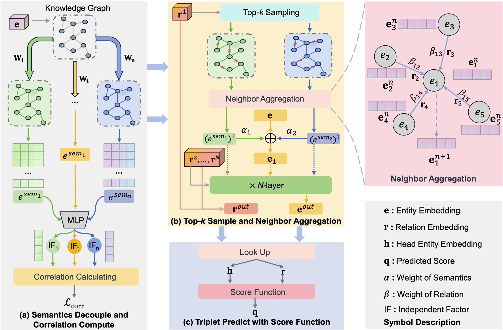

# DSGNet
 
DSGNet was implemented using PyTorch, with a CPU (Intel Xeon Gold6330) and a GPU (RTX3090). DSGNet employs an encoder-decoder architecture comprising three modules:
- The Semantic Decouple and Correlation Compute Module
- The Top-𝑘 Sample and Neighborhood Aggregation Module
- The triplet Prediction Scoring Module

The overview of DSGNet: 

<p align="center">
   
</p>

## Dependencies
- [PyTorch](https://pytorch.org/) >= 1.9.1
- [DGL](https://www.dgl.ai/) >= 1.0.2 (for GNN and top-k sampling)
- [Hydra](https://hydra.cc/) >= 1.1.1 

## Dataset:

- We use FB15k-237 and WN18RR datasets for knowledge graph link prediction. 
- FB15k-237 and WN18RR are included in the `data` directory. 

## Usage
- `code/`: includes code scripts.
- `data/`: includes datasets and outputs
- `config/`: contains configuration parameters for the dataset. You can modify the parameters here.


## Model Training
```shell script

# set the config/config.yaml `project_dir` field to your project path

# FB15k-237
python code/run.py

# WN18RR
python code/run.py dataset=WN18RR
# or you can modify parameters in `config/`
